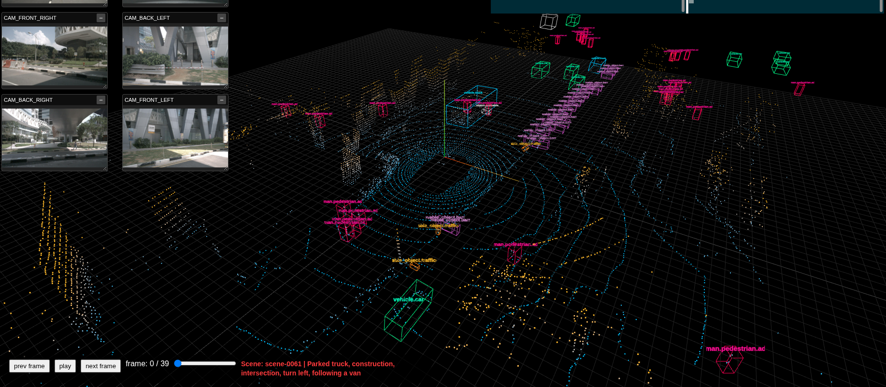

# Autonomous Driving Data Visualizer

A lightweight web application for browsing and visualizing autonomous driving datasets, with a focus on NuScenes scenes for now (including LiDAR point clouds, 3D bounding boxes, and synchronized camera views).

The project is split into:

- a FastAPI backend that exposes dataset metadata and frame data
- a Vite + Three.js frontend that renders the 3D scene and UI
- Docker-based deployment for local or server-side hosting 




## Features

- Browse available NuScenes scenes
- Scene description
- Load per-scene sample frames
- Visualize LiDAR point clouds in 3D
- Display 3D bounding boxes for each frame
- Show front/side/rear camera images (6 cameras) for each sample
- Navigate through frames using the web UI
- Todo:
  - support bev feature
  - support can bus data
  - support prediction boxes

## Tech Stack

### Backend
- Python 3.10+
- FastAPI
- NuScenes devkit

### Frontend
- JavaScript (ES modules)
- Vite
- Three.js
- Nginx for serving the production build

## Project Structure

```text
.
├── backend/
│   ├── app/
│   │   ├── api/
│   │   │   └── v1/
│   │   ├── core/
│   │   ├── schemas/
│   │   ├── services/
│   │   │   └── adapters/
│   │   └── utils/
│   ├── config.py
│   ├── main.py
│   ├── requirements.txt
│   └── Dockerfile
├── frontend/
│   ├── src/
│   |   |── core/
│   |   |── services/
│   |   |── static/
│   |   |── styles/
│   |   |── ui/
│   |   |── utils/
│   |   └── main.js
│   ├── index.html
│   ├── nginx.conf
│   ├── package.json
│   └── Dockerfile
├── docker-compose.yml
├── restart.sh
└── README.md
```

## Architecture Overview

### Backend API
The FastAPI service exposes dataset endpoints under `/api/v1`.

Key routes include:

- `GET /api/v1/scenes`
- `GET /api/v1/scenes/{scene_name}/description`
- `GET /api/v1/scenes/{scene_name}/samples`
- `GET /api/v1/pointclouds/{sample_token}/binary`
- `GET /api/v1/boxes/{sample_token}`
- `GET /api/v1/images/{sample_token}/{cam_name}`

The backend uses an adapter pattern so additional dataset backends can be added later. Right now the default and only active backend is NuScenes.

### Frontend
The frontend loads scene metadata from the backend, then fetches per-frame point clouds, boxes, and camera imagery, and renders the corresponding 3D scene in the browser.

## Prerequisites

Before running the project, make sure you have:

- Docker and Docker Compose installed
- A NuScenes dataset available locally
- Access to a mounted dataset directory such as `/mnt/sdb/datasets/nuscenes-data/nuscenes`

## Dataset Requirements

This project expects a NuScenes-style dataset directory structure. The backend reads from `NUSCENES_DATA_DIR` and initializes the NuScenes SDK using:

- `NUSCENES_DATA_DIR` (default: `/data/nuscenes`)
- `NUSCENES_VERSION` (default: `v1.0-mini`)

The default Docker Compose file mounts a host dataset path into the container:

```yaml
volumes:
  - /mnt/sdb/datasets/nuscenes-data/nuscenes:/data/nuscenes:ro
```

If your dataset is stored somewhere else, update this mount in `docker-compose.yml` or set the environment variable to match your local path.

## Quick Start with Docker

From the repository root:

```bash
docker-compose up --build
```

This will start:

- backend on `http://localhost:8000`
- frontend on `http://localhost`

The frontend proxies API requests through Nginx to the backend.

### Stop the app

```bash
docker compose down
```
